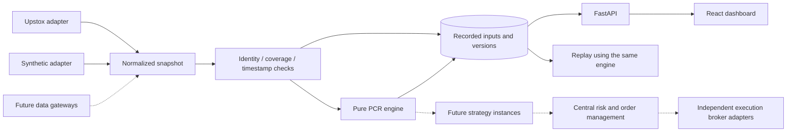

# Architecture / ADR 001

Status: accepted foundation for implementation. Scope: data recording and PCR research, with future stock/option strategy execution.

## Module boundaries

The worker owns collection and calculation. The API reads results and writes control/configuration records. The UI is not a scheduler and closing it cannot interrupt collection. Local processes share a database and project working directory. A file lock prevents duplicate local collectors. Multiple hosts are not supported until a database lease is implemented.

## Data contract

`domain.py` contains provider-neutral contracts: configuration, instrument identity, snapshot, anchor and evaluation. `gateways.py` maps external payloads into these contracts. Canonical option identity is underlying + explicit expiry + strike + call/put; provider keys remain attached for request matching and audit.

Upstox is the first real provider. The interface allows later adapters; provider registry discovery, automatic failover and cross-provider unit conversion are deliberately not implemented yet. Never sum the same contract's OI across gateways. Any fallback must validate identity, units, timestamp evidence and coverage, and persist its provenance. Data provider and execution broker will be separate configuration concepts.

Each raw collection has request start and receipt timestamps, underlying feed timestamp when supplied, optional OI source timestamp, independently fetched contract catalog and quotes. Missing/invalid OI remains null. Receipt and storage times must not be relabelled as exchange times. Provider-reported OI units are retained; no assumed lot conversion occurs.

## Storage and versioning

SQLAlchemy storage supports SQLite locally and PostgreSQL through `DATABASE_URL`. Four tables: configurations, observations, control and worker_health. Each observation stores a full normalized snapshot, raw adapter responses, evaluation, engine version, configuration ID and persisted anchor. The transaction commits inputs and derived state together. New versions require collection paused, retain old data and start an independent anchor history. An in-flight old-version collection may finish under its original version.

For this MVP, schemas are created with `create_all`; introduce Alembic migrations before any schema evolution in a deployed database. JSON observations favor auditable delivery speed. Add indexed contract-level time-series tables when measured history volume warrants it. Add retention, compression and backup policy before sustained production collection.

## UI and fast changes

Configuration form constraints come from the backend JSON schema. Adding a numeric constraint requires no duplicate frontend validation constants. Labels/field layout currently remain explicit in React. Existing parameters change without code; fundamentally new indicators need a Python module, schema and any relevant UI fields. Every chart point has a contract selection, OI totals and issues. OI and price freshness are separate from worker liveness.

One PCR configuration is active at a time in this milestone. Fixed, moving and full modes run together. Future multi-strategy support should share normalized snapshots while keeping per-instance state/configuration, signal provenance and P&L attribution. Account risk, broker reconciliation and overlapping instrument positions remain centrally managed.

## Deployment progression

1. Current: recording + PCR UI + replay verification, no order capability.
2. Validate Upstox account data during a session, field semantics, contract/expiry discovery, feed timings and quotas. Add exchange calendar, WebSocket streaming as needed and schema migrations.
3. Stock universes (NIFTY 50/custom/liquidity filters), multiple strategy instances, signals and historical replay with explicit data availability.
4. Paper execution with spreads, costs, slippage and fill assumptions; performance evaluation on held-out periods.
5. Live execution only after defined risk limits, order idempotency, fills/reconciliation, outage handling, kill switch and current broker/exchange requirements are verified.

## Official implementation references

- [Upstox option contracts](https://upstox.com/developer/api-documentation/get-option-contracts/)
- [Upstox option chain](https://upstox.com/developer/api-documentation/get-pc-option-chain/)
- [Upstox underlying quotes](https://upstox.com/developer/api-documentation/get-full-market-quote/)
- [Upstox rate limits](https://upstox.com/developer/api-documentation/rate-limiting/)
- [FastAPI](https://fastapi.tiangolo.com/tutorial/)
- [SQLAlchemy](https://docs.sqlalchemy.org/en/20/orm/quickstart.html)
- [Vite](https://vite.dev/guide/)

Checked 2026-09-09. Adapter assumptions must be validated against the actual subscribed account; mocked API tests are not an account integration test.